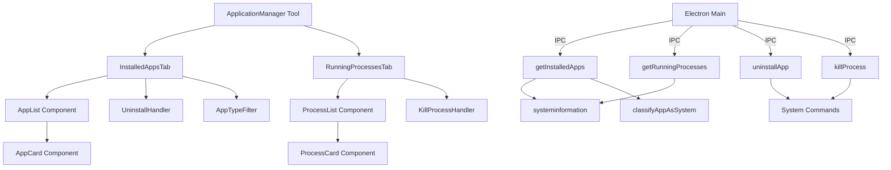

# Application Manager Tool - Implementation Plan

## Overview

Tạo một tool mới trong `src/tools/utilities/` để quản lý:
- **Installed Applications**: Danh sách apps đã cài đặt với thông tin CPU/RAM usage
- **Running Processes**: Danh sách processes đang chạy với real-time metrics
- **Cleanup Actions**: Uninstall apps và kill processes
- **Filter**: Phân biệt ứng dụng hệ thống và ứng dụng user cài đặt

## Architecture



## Implementation Plan

### 1. Backend - Electron Main Process

**File**: `electron/main/main.ts`

Thêm IPC handlers:

```typescript
// Get installed applications
ipcMain.handle('get-installed-apps', async () => {
  try {
    // Windows: Use PowerShell to get installed apps
    // macOS: Use system_profiler or lsappinfo
    // Linux: Use package manager (dpkg, rpm, etc.)
    const apps = await getInstalledApps();
    // Phân loại apps thành system và user-installed
    return apps.map(app => ({
      ...app,
      isSystemApp: classifyAppAsSystem(app)
    }));
  } catch (error) {
    console.error('Error fetching installed apps:', error);
    return [];
  }
});

// Get running processes with CPU/RAM
ipcMain.handle('get-running-processes', async () => {
  try {
    const processes = await si.processes();
    return processes.list.map(p => ({
      pid: p.pid,
      name: p.name,
      cpu: p.cpu,
      mem: p.mem,
      memPercent: (p.mem / (await si.mem()).total) * 100,
      command: p.command,
      started: p.started,
      user: p.user,
    }));
  } catch (error) {
    console.error('Error fetching processes:', error);
    return [];
  }
});

// Uninstall application
ipcMain.handle('uninstall-app', async (event, appInfo) => {
  try {
    // Kiểm tra nếu là system app thì cảnh báo
    if (appInfo.isSystemApp) {
      return { 
        success: false, 
        error: 'Cannot uninstall system application',
        requiresConfirmation: true 
      };
    }
    // Windows: Use wmic or PowerShell
    // macOS: Use system commands
    // Linux: Use package manager
    await uninstallApplication(appInfo);
    return { success: true };
  } catch (error) {
    return { success: false, error: error.message };
  }
});

// Kill process
ipcMain.handle('kill-process', async (event, pid) => {
  try {
    process.kill(pid, 'SIGTERM');
    return { success: true };
  } catch (error) {
    return { success: false, error: error.message };
  }
});
```

Helper functions:

- `getInstalledApps()`: Platform-specific implementation
  - Windows: PowerShell `Get-WmiObject Win32_Product` hoặc Registry
  - macOS: `/Applications` folder + `system_profiler`
  - Linux: `dpkg -l` (Debian) hoặc `rpm -qa` (RHEL)

- `classifyAppAsSystem(app)`: Logic để xác định app là system app
  - **Windows**: 
    - Publisher chứa "Microsoft", "Windows", "Intel", "AMD", "NVIDIA"
    - Install location trong `C:\Windows\`, `C:\Program Files\Windows`
    - Registry key trong `HKEY_LOCAL_MACHINE\SOFTWARE\Microsoft\Windows\CurrentVersion\Uninstall`
  - **macOS**:
    - Install location trong `/System`, `/Library`, `/usr`
    - Bundle ID bắt đầu với `com.apple.`
  - **Linux**:
    - Package từ system repositories (không phải PPA hoặc user-installed)
    - Package name chứa "system", "core", "base"

- `uninstallApplication()`: Platform-specific uninstall
  - Windows: `wmic product where name="..." call uninstall`
  - macOS: Remove from `/Applications` hoặc `pkgutil`
  - Linux: `apt remove` hoặc `yum remove`

### 2. Preload API

**File**: `electron/preload/preload.ts`

Thêm API methods:

```typescript
contextBridge.exposeInMainWorld('appManagerAPI', {
  getInstalledApps: () => ipcRenderer.invoke('get-installed-apps'),
  getRunningProcesses: () => ipcRenderer.invoke('get-running-processes'),
  uninstallApp: (appInfo) => ipcRenderer.invoke('uninstall-app', appInfo),
  killProcess: (pid) => ipcRenderer.invoke('kill-process', pid),
});
```

### 3. TypeScript Types

**File**: `src/types/appManager.ts` (new)

```typescript
export interface InstalledApp {
  name: string;
  version: string;
  publisher?: string;
  installDate?: string;
  installLocation?: string;
  size?: number;
  uninstallString?: string;
  icon?: string;
  isSystemApp: boolean; // Phân biệt app hệ thống và app user cài đặt
}

export interface RunningProcess {
  pid: number;
  name: string;
  cpu: number;
  mem: number;
  memPercent: number;
  command: string;
  started: string;
  user?: string;
}

export interface ProcessGroup {
  name: string;
  processes: RunningProcess[];
  totalCpu: number;
  totalMem: number;
  totalMemPercent: number;
}

export type AppFilterType = 'all' | 'user' | 'system';
```

### 4. Main Component

**File**: `src/tools/utilities/ApplicationManager.tsx` (new)

Structure:
- Tab navigation (Installed Apps / Running Processes)
- Search and filter
- Sort by CPU/RAM/Name
- Action buttons (Uninstall/Kill)

### 5. Installed Apps Tab

**File**: `src/tools/utilities/components/InstalledAppsTab.tsx` (new)

Features:
- List of installed applications
- Display: Name, Version, Size, Install Date, System/User badge
- **Filter by type**:
  - Tất cả (All)
  - Ứng dụng đã cài đặt (User Installed)
  - Ứng dụng hệ thống (System Apps)
- Search by name
- Sort by name/size/date
- Uninstall button with confirmation
  - Disable hoặc ẩn cho system apps (hoặc cảnh báo nếu cố gắng uninstall)
- Badge/indicator để phân biệt system vs user apps
- Loading state
- Empty state khi không có apps

### 6. Running Processes Tab

**File**: `src/tools/utilities/components/RunningProcessesTab.tsx` (new)

Features:
- List of running processes (grouped by name)
- Real-time CPU/RAM usage
- Auto-refresh (every 2-3 seconds)
- Display: Name, CPU%, RAM%, PID, Started, User
- Search and filter
- Sort by CPU/RAM/Name
- Kill button with confirmation
- Process grouping option
- Warning cho system processes

### 7. UI Components

**File**: `src/tools/utilities/components/AppCard.tsx` (new)
- Card component for installed app
- Shows app info và uninstall button
- System app badge (màu xám/đỏ)
- User app badge (màu xanh)
- Disable uninstall button cho system apps

**File**: `src/tools/utilities/components/ProcessCard.tsx` (new)
- Card component for process/process group
- Shows CPU/RAM bars, kill button
- Real-time updates
- Warning indicator cho system processes

**File**: `src/tools/utilities/components/ProcessMetrics.tsx` (new)
- Visual bars for CPU/RAM usage
- Color coding (green/yellow/red)

**File**: `src/tools/utilities/components/AppTypeFilter.tsx` (new)
- Filter buttons: All / User Installed / System Apps
- Active state styling
- Count badges cho mỗi filter

### 8. Hooks

**File**: `src/tools/utilities/hooks/useInstalledApps.ts` (new)
- Fetch installed apps
- Cache results
- Refresh on demand
- Filter logic (all/user/system)

**File**: `src/tools/utilities/hooks/useRunningProcesses.ts` (new)
- Fetch processes with interval
- Group processes by name
- Calculate aggregated metrics
- Throttle updates (2-3s)

### 9. Tool Registration

**File**: `src/tools/registry.tsx`

Add new tool entry:

```typescript
import { Package } from 'lucide-react';
import ApplicationManager from './utilities/ApplicationManager';

{
  id: 'application-manager',
  name: 'Application Manager',
  path: '/application-manager',
  description: 'Manage installed applications and running processes',
  category: 'utilities',
  icon: Package,
  component: ApplicationManager,
  keywords: ['apps', 'processes', 'uninstall', 'cleanup', 'task manager', 'system apps']
}
```

## Platform-Specific Implementation

### Windows

**Installed Apps**:
- PowerShell: `Get-WmiObject Win32_Product | Select-Object Name, Version, Publisher, InstallDate, InstallLocation`
- Registry: `HKEY_LOCAL_MACHINE\SOFTWARE\Microsoft\Windows\CurrentVersion\Uninstall`
- Registry (32-bit): `HKEY_LOCAL_MACHINE\SOFTWARE\WOW6432Node\Microsoft\Windows\CurrentVersion\Uninstall`

**System App Detection**:
- Publisher: "Microsoft Corporation", "Windows", "Intel", "AMD", "NVIDIA"
- Install location: `C:\Windows\`, `C:\Program Files\Windows`
- Registry key patterns

**Uninstall**:
- `wmic product where name="..." call uninstall`
- Hoặc chạy uninstallString từ registry

### macOS

**Installed Apps**:
- `/Applications` folder scan
- `system_profiler SPApplicationsDataType`
- `lsappinfo` command

**System App Detection**:
- Install location: `/System`, `/Library`, `/usr`
- Bundle ID: `com.apple.*`
- Package manager: System packages vs user packages

**Uninstall**:
- Remove from `/Applications`
- `pkgutil --unlink` cho packages

### Linux

**Installed Apps**:
- Debian/Ubuntu: `dpkg -l` hoặc `apt list --installed`
- RHEL/CentOS: `rpm -qa`
- Flatpak: `flatpak list`
- Snap: `snap list`

**System App Detection**:
- Package từ system repositories
- Package name patterns: `*-system`, `*-core`, `*-base`
- Source repository check

**Uninstall**:
- `apt remove <package>` (Debian)
- `yum remove <package>` (RHEL)
- `flatpak uninstall <app>`
- `snap remove <app>`

## Security Considerations

- Confirm before uninstall/kill actions
- Show warning for system processes/apps
- Require admin/elevated permissions where needed
- Log all destructive actions
- Prevent uninstall system critical apps
- Show confirmation dialog với warning cho system apps

## UI/UX Features

- Search and filter
- Filter by app type (All/User/System)
- Sort by multiple columns
- Group processes by name
- Color-coded CPU/RAM usage
- Badge indicators cho system vs user apps
- Confirmation dialogs
- Loading states
- Error handling
- Empty states
- Responsive design

## Performance

- Lazy load process list
- Virtual scrolling for large lists
- Debounce search input
- Cache installed apps (refresh on demand)
- Throttle process updates (2-3s interval)
- Memoize filter/sort operations

## Implementation Todos

1. Tạo TypeScript types cho InstalledApp và RunningProcess (bao gồm isSystemApp)
2. Implement backend IPC handlers trong electron/main/main.ts
   - get-installed-apps với classifyAppAsSystem
   - get-running-processes
   - uninstall-app với system app check
   - kill-process
3. Thêm appManagerAPI vào electron/preload/preload.ts
4. Tạo hook useInstalledApps với filter logic
5. Tạo hook useRunningProcesses với real-time updates
6. Tạo component InstalledAppsTab với AppTypeFilter
7. Tạo component RunningProcessesTab với grouping và metrics
8. Tạo UI components: AppCard, ProcessCard, ProcessMetrics, AppTypeFilter
9. Tạo main ApplicationManager component với tab navigation
10. Đăng ký tool trong src/tools/registry.tsx

