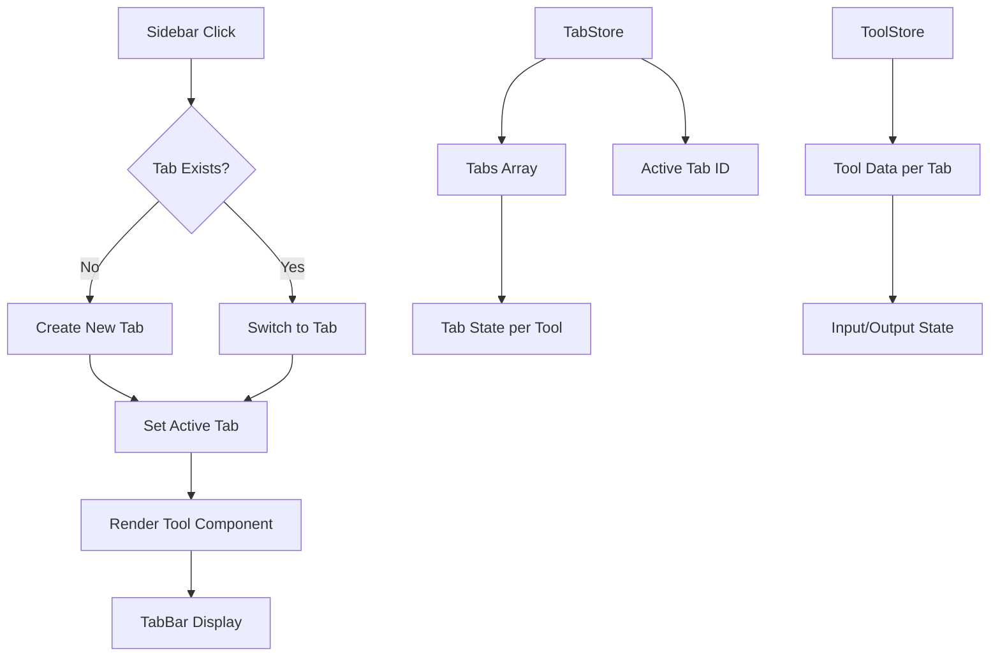
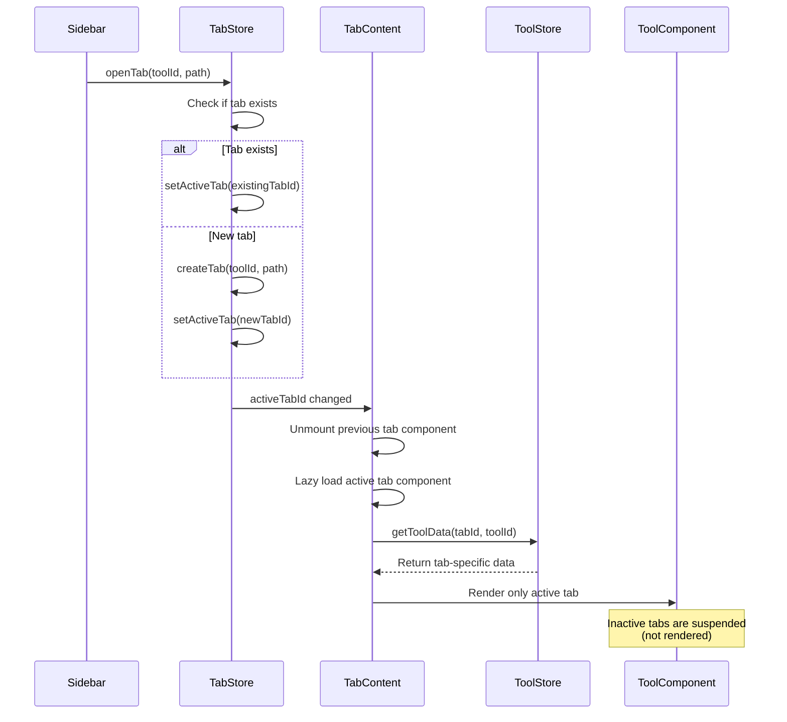

# Multi-Tab System Implementation

## Overview

Implement a tabbed interface allowing users to open and switch between multiple tools simultaneously. Each tab maintains independent state (input/output), and the sidebar intelligently switches to existing tabs or opens new ones.

## Architecture



## Implementation Steps

### 1. Create Tab Store (`src/store/tabStore.ts`)

- **Purpose**: Manage tabs state (open tabs, active tab, tab order)
- **State**:
  - `tabs: Array<{ id: string, toolId: string, title: string, path: string }>`
  - `activeTabId: string | null`
- **Actions**:
  - `openTab(toolId, path)`: Open or switch to tab
  - `closeTab(tabId)`: Close tab
  - `setActiveTab(tabId)`: Switch active tab
  - `reorderTabs(tabs)`: Reorder tabs (drag & drop)
- **Persistence**: Use Zustand persist middleware

### 2. Update Tool Store (`src/store/toolStore.ts`)

- **Modify**: Store tool data per tab instead of per tool ID
- **Change**: `tools: Record<string, ToolData>` → `tools: Record<string, Record<string, ToolData>>` (tabId -> toolId -> data)
- **Update methods**: `setToolData`, `clearToolData` to accept `tabId` parameter
- **Backward compatibility**: Migrate existing data structure

### 3. Create TabBar Component (`src/components/layout/TabBar.tsx`)

- **Features**:
  - Display all open tabs horizontally
  - Active tab indicator (macOS style)
  - Close button (X) on each tab
  - Tab title truncation
  - Scrollable when many tabs
  - **Performance optimizations**:
    - Use `React.memo` to prevent unnecessary re-renders
    - Virtual scrolling for 20+ tabs (optional, future)
    - Debounce tab switching if needed
- **Styling**: macOS-inspired with glassmorphism
- **Interactions**:
  - Click tab to switch
  - Click X to close
  - Middle-click to close (optional)
  - Drag to reorder (optional, future)

### 4. Create TabContent Component (`src/components/layout/TabContent.tsx`)

- **Purpose**: Wrapper for tool components with tab-specific state
- **Features**:
  - **Suspend inactive tabs**: Only render active tab component (performance optimization)
  - Use conditional rendering: `{activeTab && <ToolComponent />}`
  - Lazy load tool components when tab becomes active
  - Pass tab-specific data from toolStore
  - Handle tab switching animation (optional)
  - **Memory optimization**: Unmount inactive tab components to free memory

### 5. Update App.tsx

- **Changes**:
  - Add TabBar above main content area
  - Replace single `<Routes>` with tab-based rendering
  - Handle routing: `/` shows active tab, `/tool/:id` opens/switches tab
  - Keep Settings as non-tab route
- **Layout**:
  ```javascript
    <Sidebar />
    <main>
      <TabBar />
      <TabContent />
    </main>
  ```

### 6. Update Sidebar (`src/components/layout/Sidebar.tsx`)

- **Modify NavLink behavior**:
  - Replace `to={tool.path}` with `onClick` handler
  - Call `openTab(tool.id, tool.path)` from tabStore
  - Highlight active tab's tool in sidebar
- **Visual**: Keep current macOS styling

### 7. Update Tool Components

- **Performance optimizations**:
  - Wrap tool components with `React.memo` to prevent re-renders when inactive
  - Use `useMemo` for expensive computations (formatting, parsing)
  - Lazy load heavy tool components (e.g., PDF converters)
  - Debounce/throttle input handlers for real-time tools
- **State management**: Tools already use `useToolStore` hooks
- **Automatic**: Each tab instance will have separate state via tabId
- **Suspend behavior**: Inactive tabs won't render, so no updates needed

### 8. Add Tab Management Utilities

- **File**: `src/utils/tabUtils.ts`
- **Functions**:
  - `generateTabId()`: Unique ID generator
  - `getTabTitle(toolId)`: Get display name for tab
  - `validateTab(tab)`: Validate tab structure

### 9. CSS Styles (`src/index.css`)

- **Add**: `.tab-bar`, `.tab-item`, `.tab-item-active` styles
- **macOS style**: Rounded corners, glassmorphism, smooth transitions
- **Responsive**: Handle overflow with horizontal scroll

### 10. Handle Edge Cases

- **Close last tab**: Open default tool (json-format)
- **Close active tab**: Switch to previous tab
- **Navigate to Settings**: Close all tabs or keep them (decide: keep tabs)
- **Browser back/forward**: Sync with tab state
- **Initial load**: Open default tool in first tab

## Files to Create

1. `src/store/tabStore.ts` - Tab state management
2. `src/components/layout/TabBar.tsx` - Tab bar UI
3. `src/components/layout/TabContent.tsx` - Tab content wrapper
4. `src/utils/tabUtils.ts` - Tab utilities

## Files to Modify

1. `src/store/toolStore.ts` - Add tabId support
2. `src/App.tsx` - Integrate tabs
3. `src/components/layout/Sidebar.tsx` - Update navigation
4. `src/index.css` - Add tab styles

## Data Flow



## Performance Optimizations

### Tab Suspension Strategy
- **Active tab only**: Only render the currently active tab component
- **Lazy loading**: Load tool component when tab becomes active
- **Memory cleanup**: Unmount inactive tab components to free memory
- **State preservation**: Keep tool data in store even when tab is suspended

### Implementation Details
```typescript
// TabContent.tsx - Only render active tab
{activeTab && (
  <Suspense fallback={<TabLoader />}>
    <ToolComponent key={activeTab.id} tabId={activeTab.id} />
  </Suspense>
)}

// Tool components - Memoized to prevent re-renders
export const JsonFormatter = React.memo(({ tabId }) => {
  // Component logic
});
```

### Additional Optimizations
- **Debounce input**: For tools with real-time processing (formatters)
- **Throttle updates**: For tools with frequent state changes
- **Virtual scrolling**: For TabBar with 20+ tabs (future)
- **Code splitting**: Lazy load tool components per tab
- **Memoization**: Use `useMemo` for expensive computations per tab

## Testing Considerations

- Open multiple tabs (10+ tabs)
- Switch between tabs (state preserved, performance check)
- Close tabs (active tab handling)
- Click same tool twice (switch, not duplicate)
- Close all tabs (default behavior)
- **Performance**: Memory usage with 20+ tabs
- **Performance**: Tab switching speed (should be instant)
- **Performance**: No re-renders of inactive tabs

