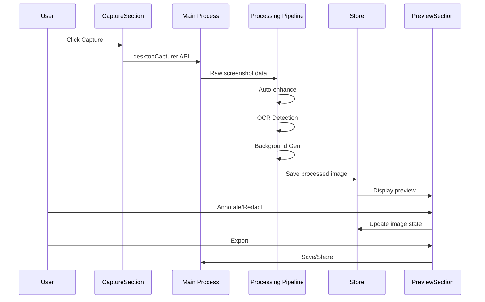
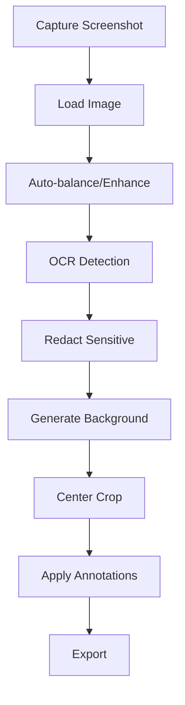

# Xnapper Clone - Screenshot Beautifier Tool

## Overview

**Xnapper Clone** là một desktop tool (Electron) cho phép capture screenshot → tự động balance/center crop → tạo background đẹp (gradient/image) → redact thông tin nhạy cảm (email/IP/API key qua OCR/regex) → annotate (arrow/text/blur) → export PNG/JPG với social presets (Twitter/LinkedIn ratios) + share.

**Core USP**: Transform screenshots thành beautiful, shareable images với minimal effort - perfect cho developers và marketers cần showcase code/work.

---

## Core Features

### 1. Screenshot Capture
- **Native Capture**: Sử dụng Electron `desktopCapturer` API
- **Selection Mode**: 
  - Full screen
  - Window selection
  - Custom area selection (drag to select)
- **Multi-monitor Support**: Chọn monitor để capture
- **Preview**: Xem preview trước khi process

### 2. Auto Enhancement
- **Auto-balance**: Tự động điều chỉnh brightness/contrast
- **Center Crop**: Smart crop để center content
- **Background Detection**: Detect và remove/replace background
- **Edge Detection**: Tự động detect edges để crop chính xác

### 3. Background Generation
- **Gradient Backgrounds**: 
  - Pre-defined gradients (macOS style, modern, vibrant)
  - Custom gradient builder (color picker + direction)
  - Animated gradients (optional)
- **Image Backgrounds**:
  - Upload custom image
  - Blur effect (bokeh style)
  - Pattern backgrounds
- **Smart Background**: AI-suggested background based on screenshot content

### 4. Sensitive Data Redaction
- **OCR Detection** (Tesseract.js):
  - Email addresses
  - IP addresses
  - API keys/tokens
  - Credit card numbers
  - Phone numbers
- **Regex Patterns**:
  - Custom regex rules
  - Pre-defined patterns (common sensitive data)
- **Redaction Methods**:
  - Blur (Gaussian blur)
  - Pixelate
  - Solid color overlay
  - Custom emoji/icon
- **Manual Selection**: User có thể manually select areas để redact

### 5. Annotation Tools
- **Arrows**: 
  - Straight arrows
  - Curved arrows
  - Customizable color, size, style
- **Text**:
  - Add text labels
  - Font selection (system fonts)
  - Color, size, alignment
  - Background box option
- **Shapes**:
  - Rectangle, circle, ellipse
  - Highlight boxes
  - Custom shapes
- **Blur Tool**: Selective blur areas
- **Crop Tool**: Manual crop adjustment
- **Undo/Redo**: Full history support

### 6. Export & Share
- **Format Options**:
  - PNG (lossless)
  - JPG (compressed)
  - WebP (modern, smaller)
- **Social Presets**:
  - Twitter (1200x675, 1200x628)
  - LinkedIn (1200x627)
  - Instagram (1080x1080, 1080x566)
  - Facebook (1200x630)
  - Custom dimensions
- **Quality Settings**: 
  - Compression level (JPG)
  - PNG optimization
- **Share Options**:
  - Copy to clipboard
  - Save to file
  - Share via system share sheet (macOS)
  - Upload to cloud (future: Imgur, Cloudinary)

### 7. History & Presets
- **Screenshot History**: Lưu các screenshots đã process
- **Presets**: Save favorite settings (background, redaction rules, export format)
- **Templates**: Pre-configured templates cho common use cases

---

## Architecture

### High-Level Architecture

```
User Action → Electron Main Process → Image Processing Pipeline → Renderer Display → Export
```

### Component Architecture

```
XnapperTool/
├── CaptureSection.tsx          # Screenshot capture UI
├── PreviewSection.tsx           # Image preview with annotations
├── BackgroundPanel.tsx          # Background selection/generation
├── RedactionPanel.tsx           # Redaction tools & settings
├── AnnotationToolbar.tsx        # Annotation tools (arrow, text, etc.)
├── ExportPanel.tsx             # Export options & presets
└── HistoryPanel.tsx             # Screenshot history
```

### Data Flow



### Processing Pipeline



---

## UI/UX Design (macOS Style)

### Layout Structure

```
┌─────────────────────────────────────────────────────────────┐
│  Xnapper - Screenshot Beautifier                            │
├─────────────────────────────────────────────────────────────┤
│  [Capture Button] [Load Image] [History] [Settings]          │
├─────────────────────────────────────────────────────────────┤
│  ┌──────────────────────┐  ┌─────────────────────────────┐ │
│  │  Preview Area        │  │  Tools Panel                │ │
│  │                      │  │                             │ │
│  │  [Screenshot Image]  │  │  Background                 │ │
│  │  + Annotations       │  │  ┌───────────────────────┐ │ │
│  │                      │  │  │ [Gradient] [Image]    │ │ │
│  │                      │  │  └───────────────────────┘ │ │
│  │                      │  │                             │ │
│  │                      │  │  Redaction                 │ │
│  │                      │  │  ┌───────────────────────┐ │ │
│  │                      │  │  │ Auto-detect: [✓]     │ │ │
│  │                      │  │  │ [Blur] [Pixelate]     │ │ │
│  │                      │  │  └───────────────────────┘ │ │
│  │                      │  │                             │ │
│  │                      │  │  Annotations               │ │
│  │                      │  │  [→] [T] [□] [○] [Blur]   │ │
│  │                      │  │                             │ │
│  │                      │  │  Export                    │ │
│  │                      │  │  ┌───────────────────────┐ │ │
│  │                      │  │  │ Format: [PNG ▼]       │ │ │
│  │                      │  │  │ Preset: [Twitter ▼]  │ │ │
│  │                      │  │  │ [Export] [Share]      │ │ │
│  │                      │  │  └───────────────────────┘ │ │
│  └──────────────────────┘  └─────────────────────────────┘ │
└─────────────────────────────────────────────────────────────┘
```

### Visual Design Elements

- **Glassmorphism**: Preview area với glass effect
- **Tool Panels**: Collapsible panels với macOS style
- **Color Palette**: 
  - Primary: Blue (macOS accent)
  - Success: Green (export success)
  - Warning: Orange (redaction warning)
  - Error: Red (processing error)
- **Icons**: Lucide React icons
- **Typography**: SF Pro Display (system font fallback)

### Interaction Patterns

1. **Capture Flow**:
   - Click "Capture" → Show selection overlay
   - Drag to select area → Preview
   - Click "Process" → Auto-enhance pipeline

2. **Annotation Flow**:
   - Select tool (arrow/text/shape)
   - Click/drag on preview → Add annotation
   - Click annotation → Edit/Delete
   - Undo/Redo buttons

3. **Redaction Flow**:
   - Auto-detect enabled → Show detected items
   - Click item → Apply redaction
   - Manual selection → Draw area → Redact

4. **Export Flow**:
   - Select format + preset
   - Click "Export" → Save dialog
   - Click "Share" → System share sheet

---

## Technical Implementation

### Tech Stack

| Component | Technology | Purpose |
|-----------|-----------|---------|
| Frontend | React + TypeScript | UI components |
| Desktop | Electron | Native capture API |
| Image Processing | Canvas API + Fabric.js | Image manipulation |
| OCR | Tesseract.js | Text detection |
| State | Zustand | State management |
| Storage | electron-store | Local storage |

### Core Libraries

```typescript
// Image Processing
import { fabric } from 'fabric'; // Canvas manipulation
import Tesseract from 'tesseract.js'; // OCR

// Electron APIs
const { desktopCapturer, nativeImage } = require('electron');

// Utilities
import { create } from 'zustand';
import { persist } from 'zustand/middleware';
```

### Processing Pipeline Implementation

#### 1. Capture Module

```typescript
// electron/main/capture.ts
export async function captureScreen(area?: Rectangle): Promise<NativeImage> {
    const sources = await desktopCapturer.getSources({
        types: ['screen', 'window'],
        thumbnailSize: { width: 1920, height: 1080 }
    });
    
    // Select source and capture
    // Return NativeImage
}
```

#### 2. Image Enhancement

```typescript
// src/utils/imageEnhancement.ts
export function autoBalance(imageData: ImageData): ImageData {
    // Calculate histogram
    // Adjust brightness/contrast
    // Return enhanced ImageData
}

export function centerCrop(
    image: HTMLImageElement, 
    targetRatio: number
): HTMLCanvasElement {
    // Calculate crop area
    // Center content
    // Return cropped canvas
}
```

#### 3. OCR Detection

```typescript
// src/utils/ocrDetection.ts
export async function detectSensitiveData(
    image: HTMLImageElement
): Promise<DetectionResult[]> {
    const { data } = await Tesseract.recognize(image, 'eng', {
        logger: m => console.log(m)
    });
    
    // Extract text
    // Apply regex patterns
    // Return bounding boxes + type
}
```

#### 4. Background Generation

```typescript
// src/utils/backgroundGenerator.ts
export function generateGradient(
    width: number,
    height: number,
    colors: string[],
    direction: 'horizontal' | 'vertical' | 'radial'
): HTMLCanvasElement {
    const canvas = document.createElement('canvas');
    const ctx = canvas.getContext('2d');
    
    // Create gradient
    // Draw to canvas
    // Return canvas
}
```

#### 5. Redaction

```typescript
// src/utils/redaction.ts
export function applyRedaction(
    canvas: HTMLCanvasElement,
    areas: RedactionArea[],
    method: 'blur' | 'pixelate' | 'solid'
): HTMLCanvasElement {
    // Apply redaction to each area
    // Return modified canvas
}
```

---

## State Management

### Store Structure

```typescript
interface ScreenshotState {
    // Current screenshot
    currentImage: string | null; // Base64 or file path
    originalImage: string | null;
    processedImage: string | null;
    
    // Processing state
    isProcessing: boolean;
    processingStep: string;
    
    // Settings
    settings: {
        autoBalance: boolean;
        autoCrop: boolean;
        autoRedact: boolean;
        redactionMethod: 'blur' | 'pixelate' | 'solid';
        backgroundType: 'gradient' | 'image' | 'none';
        backgroundConfig: BackgroundConfig;
    };
    
    // Annotations
    annotations: Annotation[];
    selectedAnnotation: string | null;
    
    // Redaction
    detectedItems: DetectionResult[];
    redactionAreas: RedactionArea[];
    
    // History
    history: ScreenshotHistory[];
    
    // Actions
    captureScreenshot: (area?: Rectangle) => Promise<void>;
    processImage: () => Promise<void>;
    addAnnotation: (annotation: Annotation) => void;
    removeAnnotation: (id: string) => void;
    applyRedaction: (area: RedactionArea) => void;
    exportImage: (format: 'png' | 'jpg', preset?: ExportPreset) => Promise<void>;
    saveToHistory: () => void;
}
```

---

## Component Structure

### Main Component

```typescript
// src/tools/screenshot/Xnapper.tsx
export const Xnapper: React.FC = React.memo(() => {
    const { 
        currentImage, 
        captureScreenshot, 
        processImage,
        // ... other state
    } = useXnapperStore();
    
    return (
        <ToolPane title="Screenshot Beautifier" description="Transform screenshots into beautiful images">
            <div className="flex h-full gap-4">
                {/* Preview Section */}
                <PreviewSection />
                
                {/* Tools Panel */}
                <ToolsPanel />
            </div>
        </ToolPane>
    );
});
```

### Sub-components

1. **CaptureSection.tsx**
   - Capture button
   - Selection mode dropdown
   - Preview thumbnail

2. **PreviewSection.tsx**
   - Canvas với Fabric.js
   - Annotation rendering
   - Zoom/pan controls
   - Undo/Redo buttons

3. **BackgroundPanel.tsx**
   - Gradient selector
   - Image upload
   - Custom gradient builder
   - Preview thumbnails

4. **RedactionPanel.tsx**
   - Auto-detect toggle
   - Detection results list
   - Redaction method selector
   - Manual selection tool

5. **AnnotationToolbar.tsx**
   - Tool buttons (arrow, text, shape, blur)
   - Color picker
   - Size slider
   - Style options

6. **ExportPanel.tsx**
   - Format selector
   - Preset dropdown
   - Quality slider
   - Export/Share buttons

---

## User Flows

### Flow 1: Quick Capture & Export

```
1. User clicks "Capture"
2. Selection overlay appears
3. User drags to select area
4. Preview shows selected area
5. User clicks "Process"
   → Auto-balance
   → Auto-crop
   → Auto-redact (if enabled)
6. User clicks "Export"
7. Select format + preset
8. Save/Share
```

### Flow 2: Full Customization

```
1. Capture screenshot
2. Process (auto-enhance)
3. Review detected sensitive data
4. Adjust redaction areas
5. Select background (gradient/image)
6. Add annotations (arrows, text)
7. Fine-tune crop
8. Export with custom settings
```

### Flow 3: Template-based

```
1. Select template (e.g., "Code Showcase")
2. Capture screenshot
3. Template applies:
   - Pre-configured background
   - Redaction rules
   - Annotation style
4. User adjusts if needed
5. Export
```

---

## Performance Optimization

### Processing Performance

| Operation | Target Time | Optimization |
|-----------|-------------|--------------|
| Capture | <100ms | Native API |
| Auto-balance | <50ms | Web Workers |
| OCR Detection | <2s | Async, progress indicator |
| Background Gen | <100ms | Canvas operations |
| Redaction | <200ms | Batch operations |
| Export | <500ms | Compression in worker |

### Memory Management

- **Image Size Limits**: 
  - Max 4K resolution (3840x2160)
  - Compress large images before processing
- **Canvas Cleanup**: Dispose unused canvases
- **History Limit**: Max 50 items, auto-cleanup
- **Lazy Loading**: Load OCR only when needed

### Code Splitting

```typescript
// Lazy load heavy dependencies
const Tesseract = lazy(() => import('tesseract.js'));
const Fabric = lazy(() => import('fabric'));
```

---

## Edge Cases

### Capture Issues
- **Permission Denied**: Show instructions to grant screen recording permission
- **Multi-monitor**: Let user select monitor
- **Window Not Found**: Show error, retry option

### Processing Issues
- **Large Images**: Warn user, offer resize option
- **OCR Failure**: Fallback to regex-only detection
- **Memory Error**: Suggest reducing image size
- **Processing Timeout**: Show progress, allow cancel

### Export Issues
- **File Save Error**: Check permissions, suggest different location
- **Format Not Supported**: Fallback to PNG
- **Share Failed**: Fallback to copy clipboard

---

## Security & Privacy

### Data Handling
- **On-device Processing**: All processing local, no upload
- **OCR Local**: Tesseract.js runs in browser (no server)
- **No Tracking**: No analytics, no data collection
- **Clear History**: Easy way to clear all data

### Permissions
- **Screen Recording**: Required for capture
- **File System**: Required for save/load
- **Clipboard**: Required for copy to clipboard

---

## MVP Roadmap

### Phase 1: Core Capture & Basic Processing (Week 1-2)
- [ ] Screenshot capture (full screen, window)
- [ ] Basic image preview
- [ ] Auto-balance enhancement
- [ ] Simple export (PNG/JPG)
- [ ] Save to file

### Phase 2: Redaction & Background (Week 3-4)
- [ ] OCR integration (Tesseract.js)
- [ ] Regex pattern detection
- [ ] Redaction tools (blur, pixelate)
- [ ] Gradient background generator
- [ ] Image background support

### Phase 3: Annotations (Week 5-6)
- [ ] Arrow tool
- [ ] Text tool
- [ ] Shape tools (rectangle, circle)
- [ ] Blur tool
- [ ] Undo/Redo

### Phase 4: Polish & Export (Week 7-8)
- [ ] Social media presets
- [ ] Custom dimensions
- [ ] Quality settings
- [ ] Share functionality
- [ ] History panel

### Phase 5: Advanced Features (Future)
- [ ] Templates
- [ ] Batch processing
- [ ] Cloud upload (Imgur, etc.)
- [ ] AI background suggestions
- [ ] Video capture (future)

---

## Testing Strategy

### Unit Tests
- Image processing functions
- OCR detection logic
- Background generation
- Redaction algorithms

### Integration Tests
- Capture → Process → Export flow
- Annotation interactions
- State management
- File operations

### E2E Tests
- Full user workflow
- Electron IPC
- File system operations
- Clipboard operations

---

## Dependencies

### Core Dependencies
```json
{
  "fabric": "^5.3.0",
  "tesseract.js": "^5.0.0",
  "react-image-crop": "^10.1.0",
  "html2canvas": "^1.4.1"
}
```

### Electron APIs
- `desktopCapturer` - Screenshot capture
- `nativeImage` - Image handling
- `clipboard` - Copy to clipboard
- `dialog` - File save dialog
- `shell` - Share functionality

---

## Implementation Checklist

### Setup
- [ ] Create tool directory structure
- [ ] Install dependencies (fabric, tesseract.js)
- [ ] Setup Electron permissions for screen capture
- [ ] Create Xnapper store (Zustand)

### Core Features
- [ ] Implement capture functionality
- [ ] Implement image processing pipeline
- [ ] Implement OCR detection
- [ ] Implement redaction tools
- [ ] Implement background generation
- [ ] Implement annotation tools
- [ ] Implement export functionality

### UI Components
- [ ] CaptureSection component
- [ ] PreviewSection with Fabric.js canvas
- [ ] BackgroundPanel component
- [ ] RedactionPanel component
- [ ] AnnotationToolbar component
- [ ] ExportPanel component

### Integration
- [ ] Add to tools registry
- [ ] Add to sidebar navigation
- [ ] Add to 'development' or new 'screenshot' category
- [ ] Update routing

### Polish
- [ ] macOS styling
- [ ] Loading states
- [ ] Error handling
- [ ] Empty states
- [ ] Accessibility
- [ ] Keyboard shortcuts

### Testing
- [ ] Unit tests
- [ ] Integration tests
- [ ] Manual testing on macOS
- [ ] Performance testing

---

## Example Implementation

### Basic Capture Component

```typescript
// src/tools/screenshot/components/CaptureSection.tsx
import React, { useState } from 'react';
import { Button } from '../../../components/ui/Button';
import { Monitor, Window, Square } from 'lucide-react';

export const CaptureSection: React.FC = () => {
    const [captureMode, setCaptureMode] = useState<'screen' | 'window' | 'area'>('screen');
    const { captureScreenshot } = useXnapperStore();
    
    const handleCapture = async () => {
        try {
            await captureScreenshot(captureMode);
        } catch (error) {
            toast.error('Failed to capture screenshot');
        }
    };
    
    return (
        <div className="space-y-4">
            <div className="flex gap-2">
                <Button
                    variant={captureMode === 'screen' ? 'primary' : 'secondary'}
                    onClick={() => setCaptureMode('screen')}
                    icon={Monitor}
                >
                    Full Screen
                </Button>
                <Button
                    variant={captureMode === 'window' ? 'primary' : 'secondary'}
                    onClick={() => setCaptureMode('window')}
                    icon={Window}
                >
                    Window
                </Button>
                <Button
                    variant={captureMode === 'area' ? 'primary' : 'secondary'}
                    onClick={() => setCaptureMode('area')}
                    icon={Square}
                >
                    Area
                </Button>
            </div>
            
            <Button
                variant="primary"
                onClick={handleCapture}
                className="w-full"
            >
                Capture Screenshot
            </Button>
        </div>
    );
};
```

---

## Next Steps

1. **Research**: Test Electron `desktopCapturer` API
2. **Prototype**: Build basic capture → preview flow
3. **Integrate**: Add OCR library (Tesseract.js)
4. **Build**: Implement processing pipeline
5. **Polish**: Add UI/UX refinements
6. **Test**: Comprehensive testing
7. **Deploy**: Add to app

---

## Resources

- [Electron desktopCapturer API](https://www.electronjs.org/docs/latest/api/desktop-capturer)
- [Fabric.js Documentation](http://fabricjs.com/)
- [Tesseract.js Documentation](https://tesseract.projectnaptha.com/)
- [Canvas API](https://developer.mozilla.org/en-US/docs/Web/API/Canvas_API)

