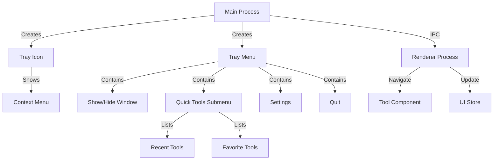

#

System Tray Implementation Plan

## Overview

Add a system tray icon with a context menu that provides quick access to tools, window controls, and settings. The tray will always be visible and support minimize-to-tray functionality.

## Architecture

## Implementation Details

### 1. Tray Icon Asset

- **File**: `public/tray-icon.png` (16x16, 22x22, 32x32 sizes)

- Create a minimal monochrome icon matching the app's aesthetic

- Use a simple geometric shape or app logo in monochrome

- Support both light and dark system themes

### 2. Main Process Updates

**File**: `electron/main/main.ts`

- Import `Tray` and `Menu` from Electron
- Create tray instance on app ready
- Build context menu with:
- **Show/Hide Window** (toggle)

- **Quick Tools** (submenu with recent/favorites)

- **Settings** (opens settings page)

- **Separator**

- **Quit** (exits app)

- Handle window minimize-to-tray
- Handle tray icon click (show/hide window)

- Update menu dynamically when tools change

### 3. IPC Communication

**File**: `electron/preload/preload.ts`

Add IPC handlers:

- `tray-show-window` - Show main window

- `tray-hide-window` - Hide main window

- `tray-get-recent-tools` - Get recent tools list

- `tray-get-favorite-tools` - Get favorite tools list

- `tray-navigate-to-tool` - Navigate to specific tool

**File**: `electron/main/main.ts`

Add IPC handlers:

- `tray-update-menu` - Update tray menu with latest tools

- `window-minimize-to-tray` - Minimize window to tray

### 4. State Management

**File**: `src/store/trayStore.ts` (new)

Create Zustand store for:

- `isWindowVisible: boolean`

- `minimizeToTray: boolean` (setting)

- `recentTools: string[]` (tool IDs)

- Actions to update tray state

### 5. Settings Integration

**File**: `src/store/settingsStore.ts`Add tray-related settings:

- `minimizeToTray: boolean` - Enable minimize to tray

- `startMinimized: boolean` - Start app minimized

**File**: `src/pages/Settings.tsx`

Add UI controls for tray settings in settings page.

### 6. Window Behavior

**File**: `electron/main/main.ts`

- On window close: if `minimizeToTray` is enabled, hide window instead of closing
- On app ready: if `startMinimized` is enabled, start hidden
- Handle macOS dock behavior (keep app running when window closed)

### 7. Tool Quick Access

**File**: `src/store/toolStore.ts` (or create new)Track:

- Recent tools (last 5-10 used)

- Favorite tools (user-selected)

Update tray menu when tools change via IPC.

## File Changes

### New Files

- `public/tray-icon.png` - Tray icon asset (16x16, 22x22, 32x32)

- `src/store/trayStore.ts` - Tray state management

### Modified Files

- `electron/main/main.ts` - Add tray creation and menu logic

- `electron/preload/preload.ts` - Add tray IPC handlers

- `src/store/settingsStore.ts` - Add tray settings
- `src/pages/Settings.tsx` - Add tray settings UI
- `src/store/toolStore.ts` - Track recent/favorite tools (if needed)

## Implementation Steps

1. **Create tray icon** - Design minimal monochrome icon

2. **Implement tray in main process** - Create tray with basic menu
3. **Add IPC handlers** - Set up communication between main and renderer
4. **Add state management** - Create tray store and update settings store

5. **Implement minimize-to-tray** - Handle window close behavior

6. **Add quick tools menu** - Populate submenu with recent/favorites
7. **Add settings UI** - Allow users to configure tray behavior

8. **Test on macOS and Windows** - Ensure cross-platform compatibility

## UI Recommendations

### Tray Icon Design

- Minimal geometric shape (circle, square, or app logo)

- Monochrome (works in light/dark system themes)
- 16x16px minimum size

- High contrast for visibility

### Context Menu Style

- Native system menu (Electron handles styling)
- Group related items with separators

- Use keyboard shortcuts where appropriate

- Show tool icons next to tool names (if possible)

### Settings UI

Add to Settings page:

- Toggle: "Minimize to tray when closing window"

- Toggle: "Start minimized"

- Info text explaining tray behavior

## Cross-Platform Considerations

- **macOS**: Tray icon appears in menu bar (top right)

- **Windows**: Tray icon appears in system tray (bottom right)

- **Linux**: Tray icon appears in system tray (varies by DE)

- Handle platform-specific menu behaviors

- Test icon visibility in both light and dark system themes

## Future Enhancements

- Tray icon badge/notification for active operations

- Tool usage statistics in tray menu

- Quick actions (e.g., "New UUID", "Format JSON") directly from tray